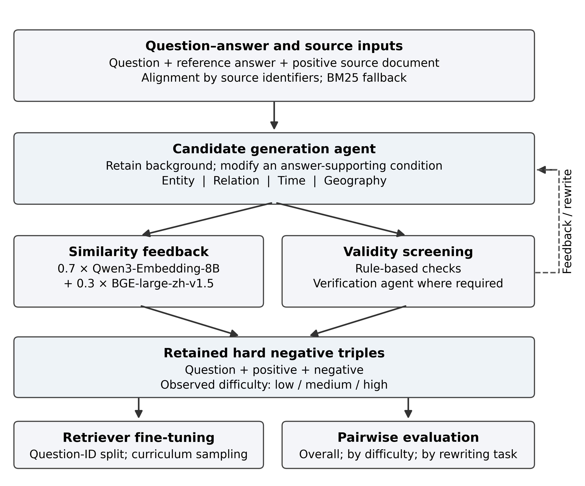

# Multi-agent hard negative construction

Code, data and reported evaluation results for **Multi-agent hard negative construction for evidence retrieval in complex news question answering**, by Shuyang Feng and Haiping Yang, School of Information Management, Nanjing University.

The workflow constructs negative documents by changing answer-supporting conditions while retaining the surrounding context. Candidate generation, two-model similarity feedback, rule screening and semantic verification are coordinated to produce retrieval training triples.



## Included materials

| Location | Contents |
| --- | --- |
| `experiments/data/` | Original QA/event inputs, 11,325 constructed triples and fixed train/evaluation splits |
| `experiments/scripts/` | Construction, splitting, training, evaluation and supporting scripts |
| `results/evaluations/` | Three original aggregate evaluation JSON files |
| `results/tables/` | Tables regenerated from those saved results |
| `assets/` | English manuscript figures |
| `docs/DATA_CARD.md` | Provenance, schema, sample counts and evaluation scope |
| `docs/REPRODUCIBILITY.md` | Generation configuration, screening routes and reproduction details |
| `docs/RELEASE_NOTES.md` | Packaging changes and checks performed |
| `SHA256SUMS` | Checksums of the released data and evaluation JSON files |

The Chinese inputs and generated documents are retained in their original language. English examples in the manuscript are presentation translations. Model weights and embedding caches are not included.

## Quick start without models or API access

Run commands from the repository root. Python 3.10 or later is required. The following checks and result-table reconstruction use only the Python standard library:

```bash
python experiments/scripts/validate_release.py
python experiments/scripts/reproduce_artifacts.py
python -m unittest discover -s tests -v
```

`validate_release.py` checks checksums, record structure, counts, split separation, difficulty metadata and equivalence to a split regenerated with seed 42. `reproduce_artifacts.py` writes a split reconstruction and result tables under ignored output directories. These commands do not train a model or claim to reproduce inference.

## Data

| File | Records | Question–answer identifiers |
| --- | ---: | ---: |
| `NHMil_QA.txt` | 3,882 QA pairs | 3,882 |
| `train_dataset.json` | 11,325 triples | 3,775 |
| `train_split.json` | 9,627 triples | 3,209 |
| `eval_split.json` | 1,698 triples | 566 |

Each retained question has three requested difficulty targets. Observed difficulty, used for training and subgroup analysis, can differ from the request. The split is by question identifier: no identifier appears in both subsets. Positive source documents can be shared across subsets. See the [data card](docs/DATA_CARD.md).

## Installation for training and evaluation

Create an environment and install the dependencies:

```bash
python -m venv .venv
python -m pip install -r requirements.txt
```

Activate `.venv` before the installation command: use `source .venv/bin/activate` on Linux/macOS, or `.venv\Scripts\Activate.ps1` in Windows PowerShell. Install a PyTorch build appropriate for your CUDA installation when using a GPU. The supplied dependency ranges are installation guidance; the original experiment did not include an environment lockfile.

### Train BGE-Align

```bash
python experiments/scripts/train_embedding.py --data experiments/data/train_split.json --base_model BAAI/bge-large-zh-v1.5 --output_dir experiments/runs/bge_align --batch_size 8 --grad_acc 4 --epochs 3 --max_seq_length 512 --lr 2e-5 --seed 42 --no-use_amp
```

The final checkpoint is written to `experiments/runs/bge_align/final`. This command uses the released training split, the three-epoch difficulty schedule and full precision. An NVIDIA RTX 3090 was used in the reported run. Public-release defaults also select the training split and disable mixed precision.

### Evaluate a local or downloaded model

```bash
python experiments/scripts/evaluate_embedding.py --model BAAI/bge-large-zh-v1.5 --data experiments/data/eval_split.json --output results/reproduced/eval_base.json --report results/reproduced/eval_base.md
python experiments/scripts/evaluate_embedding.py --model experiments/runs/bge_align/final --data experiments/data/eval_split.json --output results/reproduced/eval_align.json --report results/reproduced/eval_align.md
```

Models are downloaded on demand unless already cached. For offline use, first prepare the model locally and supply its directory with `--local_files_only`.

### Evaluate a remote embedding endpoint

Copy `.env.example` to `.env` and fill in `EMBEDDING_API_KEY` and `EMBEDDING_BASE_URL` locally. The evaluator reads these values without printing them:

```bash
python experiments/scripts/evaluate_embedding.py --backend openai-compatible --model qwen/qwen3-embedding-8b --data experiments/data/eval_split.json --output results/reproduced/eval_qwen8b.json --report results/reproduced/eval_qwen8b.md
```

The API model identifier must match the one exposed by your provider. Cached vectors are written under `experiments/cache/`, which is excluded from version control.

## Optional: construct new candidates

The released triples are sufficient for training. Regeneration makes API calls and may yield different texts. Fill in all four credential/base-URL variables in `.env`; the reported generation endpoint identifier is `deepseek-v4-flash` and the heavy embedding identifier is `qwen/qwen3-embedding-8b`.

```bash
python experiments/scripts/pipeline.py --sample 5 --workers 1 --output experiments/generated/smoke/train_dataset.json
python experiments/scripts/pipeline.py --workers 5 --output experiments/generated/full/train_dataset.json
```

The two commands use separate output directories so that a small trial does not share checkpoint files with a full run. Generation writes outside the released dataset by default. Original Chinese prompts and numerical screening rules are preserved. The method uses distinct generation and verification roles at the same model endpoint, with Qwen/BGE similarity weights of 0.7/0.3.

## Reported paired-ranking results

| Model | P@1 / Recall@1 | MRR@10 | FDR | Average margin |
| --- | ---: | ---: | ---: | ---: |
| BGE-large-zh-v1.5 | 0.8422 | 0.9211 | 0.8422 | 0.0586 |
| Qwen3-Embedding-8B | 0.8410 | 0.9205 | 0.8410 | 0.0639 |
| BGE-Align | 0.9947 | 0.9973 | 0.9947 | 0.6044 |

These values come from the supplied evaluation reports. Each record contains one positive and one negative; the evaluator ranks only this pair. MRR@10 is consequently determined by P@1, and Recall@5 is always one. FDR counts strict positive-score wins, whereas ranking puts the positive first in a tie. This is a question-disjoint evaluation within a shared source corpus, not full-corpus retrieval.

## Source attribution and citation

NHMil_QA and the event material originate from Feng and Yang's earlier news RAG benchmark study: [original source publication](https://link.cnki.net/urlid/61.1167.g3.20260728.1418.010). The source benchmark concerns South China Sea news and events. This repository adds the generated negative documents, training triples and associated experimental code; the generic repository title does not change the origin of the inputs.

